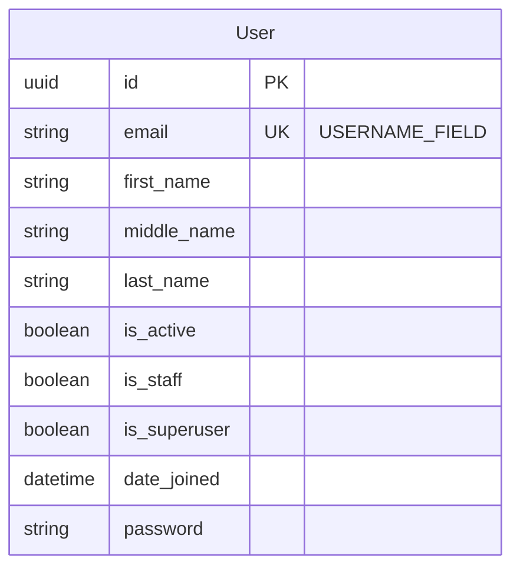

## Context
The RBAC service requires a custom user model to support user identity management with specific fields (first name, middle name, last name) and email-based authentication. Django's default User model uses username as the primary identifier, which does not align with the requirement for email-based authentication.

### Constraints
- Must be configured before any migrations are created (Django best practice)
- Must support Django's authentication system (AbstractBaseUser or AbstractUser)
- Must integrate with Django REST Framework for API endpoints
- Must support PostgreSQL as per project requirements

## Goals / Non-Goals

### Goals
- Create a custom User model with first_name, middle_name, last_name, and email fields
- Use email as the unique identifier for authentication (USERNAME_FIELD)
- Provide a custom user manager for user creation
- Ensure compatibility with Django admin and DRF authentication
- Follow Django's "start with custom user model" best practice

### Non-Goals
- Implementing role/permission models (separate capability)
- User registration flow (separate capability)
- Password reset flow (separate capability)
- Email verification (separate capability)

## Decisions

### Decision 1: Extend AbstractBaseUser instead of AbstractUser
**Rationale**: AbstractUser includes many fields we don't need (username, first_name, last_name with different semantics, groups, user_permissions). AbstractBaseUser provides a clean slate with only password handling, allowing us to define exactly the fields we need.

**Alternatives considered**:
- AbstractUser: Too many unused fields, conflicts with our email-as-username requirement
- Proxy model: Cannot change the underlying model structure or authentication fields

### Decision 2: Use UserManager and BaseUserManager
**Rationale**: Django's documentation recommends creating a custom user manager when using AbstractBaseUser. This provides create_user() and create_superuser() methods that properly handle password hashing.

### Decision 3: Email as USERNAME_FIELD and REQUIRED_FIELDS
**Rationale**: Django's authentication system requires a USERNAME_FIELD. Using email as the username field is standard practice for modern applications and aligns with the requirement. REQUIRED_FIELDS will be empty since email covers all identification needs.

### Decision 4: Create a separate Django app for users
**Rationale**: Keeping user models in a dedicated app (e.g., `users`) follows Django best practices for code organization and makes future additions (profile, preferences) easier to manage.

## Database Schema

## Migration Plan

### Steps
1. Create new Django app `users`
2. Create custom User model in `users/models.py`
3. Create custom UserManager in `users/managers.py`
4. Add `users` to INSTALLED_APPS in settings
5. Set AUTH_USER_MODEL = 'users.User' in settings
6. Create and run initial migrations
7. Update admin.py to register custom User model

### Rollback
If issues arise before deployment:
1. Remove AUTH_USER_MODEL setting
2. Remove `users` from INSTALLED_APPS
3. Delete the `users` app directory
4. Delete migrations

**Warning**: Once migrations are applied and other models reference the User model, rollback becomes complex. This is why the change must be done first.

## Risks / Trade-offs

| Risk | Mitigation |
|------|------------|
| Breaking change if migrations already exist | Document that this must be done first; check for existing migrations |
| Django admin integration issues | Create custom UserAdmin class |
| DRF serializer compatibility | Create custom UserSerializer |
| Email uniqueness constraint | Add unique=True to email field |

## Open Questions
- Should middle_name be optional or required? (Assuming optional based on common practice)
- Should email be case-insensitive for uniqueness? (Django default is case-sensitive; recommend case-insensitive)
- What is the maximum length for name fields? (Recommend 255 for flexibility)
