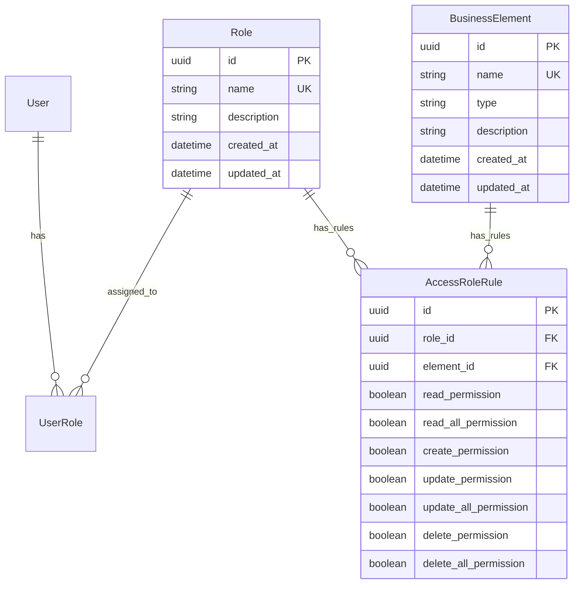

## Context
The RBAC service requires core role-based access control functionality to manage user roles, business elements, and access rules. This is the foundational capability for the entire RBAC system, enabling fine-grained authorization control over protected resources. The system uses Django ORM for data persistence and follows Django's MTV pattern.

### Constraints
- Must integrate with the existing custom User model
- Must support Django admin for management
- Must follow Django best practices for model design
- Must use SQLite database (as per project settings)

## Goals / Non-Goals

### Goals
- Create Role model to represent user roles
- Create BusinessElement model to represent protected resources
- Create AccessRoleRule model to define permission relationships between roles and business elements
- Support granular permissions: read, read_all, create, update, update_all, delete, delete_all
- Register models with Django admin for easy management
- Follow Django conventions and project coding standards

### Non-Goals
- User-role assignment (separate capability)
- Permission checking logic (separate capability)
- API endpoints for RBAC management (separate capability)
- Role hierarchy (future enhancement)
- Audit logging (future enhancement)

## Decisions

### Decision 1: Create a separate Django app for RBAC
**Rationale**: Keeping RBAC models in a dedicated app (rbac) follows Django best practices for code organization and makes future additions (permissions checking, API endpoints) easier to manage. This aligns with the existing users app pattern.

**Alternatives considered**:
- Add to users app: Would mix concerns; users app should focus on user identity
- Add to rbac_service app: Violates Django app organization principles

### Decision 2: Use CharField for Role name with unique constraint
**Rationale**: Role names need to be unique identifiers within the system. CharField provides flexibility for role naming while ensuring uniqueness through the unique constraint.

**Alternatives considered**:
- SlugField: More restrictive, requires slugification
- Integer ID: Not human-readable

### Decision 3: Use CharField for BusinessElement name and type
**Rationale**: Business elements need descriptive names and type classification for flexible resource management. CharField provides sufficient flexibility for naming conventions.

**Alternatives considered**:
- ForeignKey to a ResourceType model: Adds complexity without clear benefit at this stage
- EnumField: Less flexible for future type additions

### Decision 4: Boolean fields for permissions in AccessRoleRule
**Rationale**: Permissions are binary (granted or not granted). Boolean fields are the most efficient and straightforward representation. The _all variants (read_all, update_all, delete_all) allow for distinguishing between access to own resources vs all resources.

**Alternatives considered**:
- Integer bitmask: More complex to query and understand
- Many-to-many to Permission model: Over-engineering for initial implementation

### Decision 5: Unique constraint on (role, element) in AccessRoleRule
**Rationale**: A role should have only one access rule per business element. This prevents duplicate rules and simplifies permission lookup.

**Alternatives considered**:
- Allow duplicates: Would create ambiguity in permission resolution

## Database Schema

Note: UserRole model is not part of this change but is shown for context on how users will be assigned to roles in future capabilities.

## Migration Plan

### Steps
1. Create new Django app `rbac` using `uv run manage.py startapp rbac`
2. Add `rbac` to INSTALLED_APPS in [`rbac_service/settings.py`](rbac_service/settings.py)
3. Create Role model in `rbac/models.py`
4. Create BusinessElement model in `rbac/models.py`
5. Create AccessRoleRule model in `rbac/models.py`
6. Register models in `rbac/admin.py`
7. Create migrations: `uv run manage.py makemigrations rbac`
8. Run migrations: `uv run manage.py migrate`

### Rollback
If issues arise before deployment:
1. Remove `rbac` from INSTALLED_APPS
2. Delete the `rbac` app directory
3. Delete migrations

**Warning**: Once migrations are applied and other models reference RBAC models, rollback becomes complex.

## Risks / Trade-offs

| Risk | Mitigation |
|------|------------|
| Model design changes needed for future features | Keep models flexible; use migrations for schema changes |
| Permission resolution complexity | Defer to future capability; focus on data model first |
| BusinessElement type management | Use CharField for flexibility; consider enum or foreign key later |
| AccessRoleRule uniqueness enforcement | Use Meta.unique_together constraint |

## Open Questions
- Should Role have an is_active flag for soft deletion? (Recommend adding for audit trail)
- Should BusinessElement support hierarchical relationships? (Defer to future capability)
- What is the maximum length for name and description fields? (Recommend 255 for names, 1000 for descriptions)
- Should created_at/updated_at be auto-managed? (Recommend auto_now_add/auto_now)
